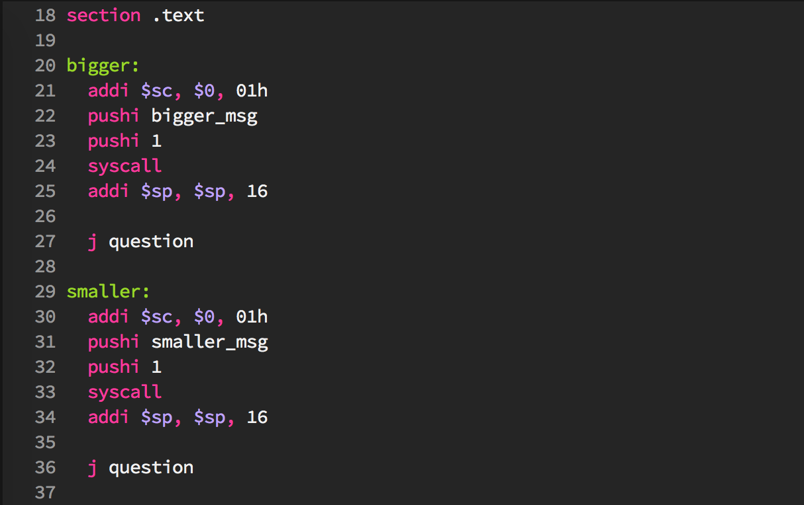

# Major mode for editing Haxor Assembly Files
[](https://stable.melpa.org/#/haxor-mode)
[](https://melpa.org/#/haxor-mode)



## How to install
The recommended way to install is via [MELPA](https://github.com/milkypostman/melpa#usage).

If you are [use-package](http://stable.melpa.org/#/use-package) user:
```
(use-package haxor-mode
  :ensure t
  :defer t
  :mode ("\\.hax\\'" . haxor-mode))
```

## More information
This mode is intended for users of educational Virtual Machine running assembly-like language "Haxor VM".  
[Follow](https://github.com/krzysztof-magosa/haxor) to project repository for more information.
